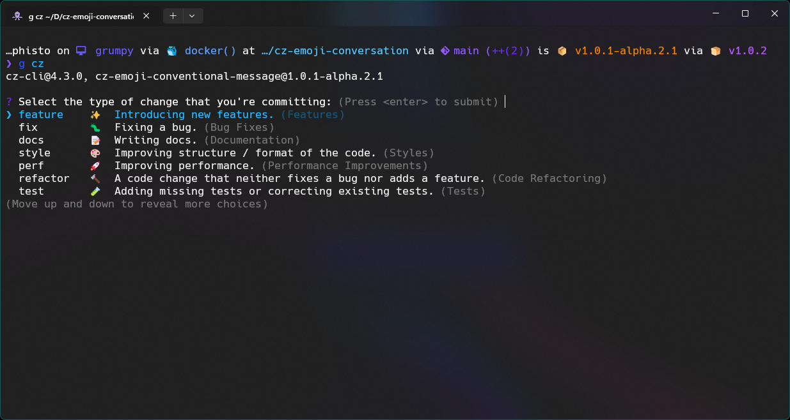

<div align="center">
  <h1><code>🦄</code> CZ Emoji Conventional Message</h1>
  <p>
    <strong>Commitizen adapter for conventional-changelog that uses emojis for commit types.</strong>
  </p>
  
</div>

## `📄` Description

A [commitizen](https://github.com/commitizen/cz-cli) adapter for [conventional-changelog](https://github.com/conventional-changelog/conventional-changelog) that uses emojis for commit types.

## `📝` Commit Types

| Commit Type | Emoji | Description                                                    |
| :---------- | :---: | :------------------------------------------------------------- |
| `feature`   |  ✨   | Introducing new features.                                      |
| `fix`       |  🐛   | Fixing a bug.                                                  |
| `docs`      |  📝   | Writing docs.                                                  |
| `style`     |  🎨   | Improving structure / format of the code.                      |
| `perf`      |  🚀   | Improving performance.                                         |
| `refactor`  |  🔨   | A code change that neither fixes a bug nor adds a feature.     |
| `test`      |  🧪   | Adding missing tests or correcting existing tests.             |
| `build`     |  👷   | Changes that affect the build system or external dependencies. |
| `ci`        |  🔧   | Changes to our CI configuration files and scripts.             |
| `rev`       |  ⏪   | Reverting changes.                                             |
| `wip`       |  🚧   | Work in progress.                                              |

## `🚀` Features

- [x] Commitizen adapter
- [x] Support for emojis
- [x] Searchable commit types

```shell
? Select the type of change that you're committing: (Press <enter> to submit)
❯ feature    ✨  Introducing new features. (Features)
  fix        🐛  Fixing a bug. (Bug Fixes)
  docs       📝  Writing docs. (Documentation)
  style      🎨  Improving structure / format of the code. (Styles)
  perf       🚀  Improving performance. (Performance Improvements)
  refactor   🔨  A code change that neither fixes a bug nor adds a feature. (Code Refactoring)
  test       🧪  Adding missing tests or correcting existing tests. (Tests)
(Move up and down to reveal more choices)
```

```shell
[feature]:  ✨ Introducing new features. (Features)
[fix]:      🐛 Fixing a bug. (Bug Fixes)
[docs]:     📝 Writing docs. (Documentation)
[style]:    🎨 Improving structure / format of the code. (Styles)
[perf]:     🚀 Improving performance. (Performance Improvements)
[refactor]: 🔨 A code change that neither fixes a bug nor adds a feature. (Code Refactoring)
[test]:     🧪 Adding missing tests or correcting existing tests. (Tests)
[build]:    👷 Changes that affect the build system or external dependencies.
[ci]:       🔧 Changes to our CI configuration files and scripts. (Continuous Integrations)
[rev]:      ⏪ Reverting changes. (Reverts)
[wip]:      🚧 Work in progress. (WIP)
```

## `📦` Installation

```shell
npm install --save-dev cz-emoji-conventional-message
# or
npm install --global cz-emoji-conventional-message
```

## `🔧` Usage

### `📝` Commitizen

```json
{
  "config": {
    "commitizen": {
      "path": "cz-emoji-conventional-message"
    }
  }
}
```

## `📄` License

See the [LICENSE](LICENSE) file for license rights and limitations (MIT).
